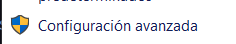
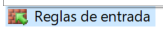
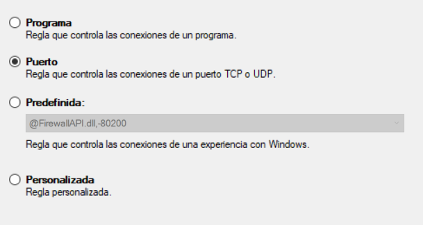
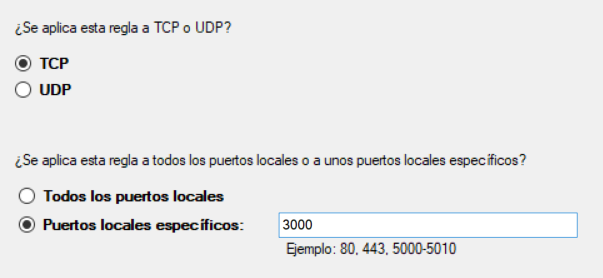
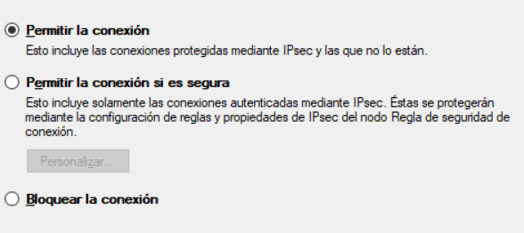
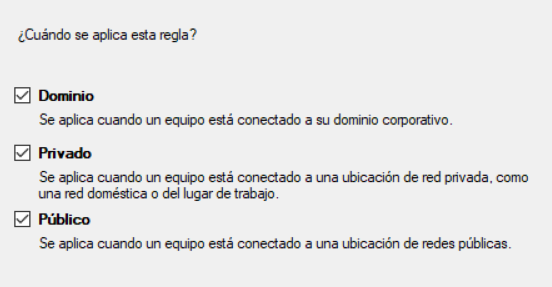
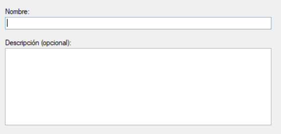

# Instrucciones para ejecutar correctamente el proyecto

## Configuraciones del sistema
Para que el proyecto pueda ejecutarse sin problemas hay que hacer algunas configuraciones previas en el computador.
1. Crear una regla en el firewall para aceptar la entrada de requests en el puerto 3000.
    - Entrar a las configuraciones del Firewall:
    - 
    - Configuracion avanzada:
    - 
    - Reglas de entrada:
    - 
    - Nueva regla:
    - 
    - Seleccionar la opción de Puerto:
    - 
    - Especificar protocolo TCP y el puerto 3000:
    - 
    - Seleccionar 'Permitir la conexion':
    - 
    - Elegir todas las opciones de perfil:
    - 
    - Darle nombre y descripción a la regla:
    - 
    - Finalizar para guardar la regla
2. Si se está usando una máquina virtual como WSL se debe hacer el link entre la IP de la máquina virtual con alguna de las IPs de la máquina de Windows.
    - Ejecutar el siguiente comando en WSL para obtener la IP de la máquina virtual:
        ```bash
        hostname -I
        ```
    - Ejecutar el siguiente comando en el CMD de Windows en modo administrador, reemplazando '{ip_de_wsl}' con la ip obtenida anteriormente:
        ```bash
        netsh interface portproxy add v4tov4 listenport=3000 listenaddress=0.0.0.0 connectport=3000     connectaddress={ip_de_wsl}
        ```
    - Revisar la ip a la que se hizo el link ejecutando el siguiente comando en CMD:
        ```bash
        ipconfig
        ```
    - Buscar la ip asociada en Windows en la siguiente sección de los resultados:
        ```bash
        Adaptador de LAN inalámbrica Wi-Fi:
            ...
            Dirección IPv4. . . . . . . . . . . . . . : {ip_de_windows}
            ...
        ```
## Configuraciones de backend
1. Instalar las dependencias:
    ```bash
    bundle install
    yarn install
    ```
2. Configurar los tokens de entorno para la verificación de usuarios:
    - Eliminar el de encriptación en el caso de que exista:
        ```bash
        rm config/*.yml.enc
        ```
    - Crear la clave para validar los tokens:
        ```bash
        rails runner "require 'securerandom'; puts SecureRandom.hex(64)"
        ```
    - Agregar la clave generada a los entornos necesarios de ejecución, abriéndolos con los siguientes comandos:
        ```bash
        EDITOR="nano" rails credentials:edit --environment test # para el entorno de testeo
        EDITOR="nano" rails credentials:edit --environment development # para el entorno de desarrollo
        ```
    -Al final de cada uno de esos archivos, agregar la siguiente línea:
    ```bash
    devise_jwt_secret_key: [clave generada por comando anterior sin estos corchetes]
    ```
3. Ejecutar el siguiente comando para inicializar la base de datos:
    ```Bash
    bin/rails db:drop db:create db:migrate db:seed
    ```
## Configuraciones de frontend
1. Configurar un archivo '.env' en el directorio raíz de 'hybrid-frontend' con el siguiente contenido, reemplazando '{ip_de_windows}' con la ip asociada obenida de Windows en el paso anterior:
    ```bash
    API_URL=http://{ip_de_windows}:3000
    ```
2. Instalar las dependencias:
    ```bash
    npm install
    yarn install
    ```
3. Hay una dependencia del frontend que debe ser instalada manualmente con el siguiente comando:
    ```bash
    npm install react-native-pager-view
    ```
## Ejecucion del proyecto
1. Ejecutar el siguiente comando para iniciar el servidor de backend en la IP necesaria:
    ```bash
    bin/rails server -b 0.0.0.0
    ```
2. Ejecutar el siguiente comando para iniciar el servidor de frontend:
    ```bash
    npm start
    ```